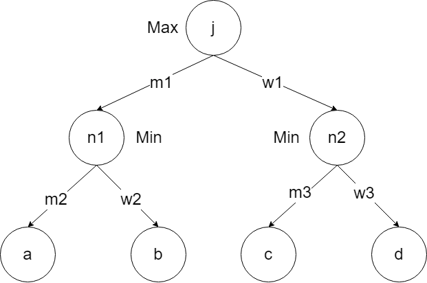
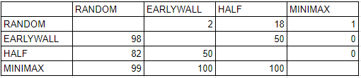

# Projet-quoridor
Projet IA et Jeux 2022-2023, L3 Sorbonne Université

## Présentation générale du projet

On propose dans ce projet d'implémenter une version librement inspirée du jeu Quoridor.
Le principe général du jeu est le suivant: chaque joueur cherche à être le premier à traverser le terrain.
Chaque joueur jour à tour de rôle. Les coups possibles sont:
* le déplacement de son joueur,
* le dépôt d'un mur de 2 cases sur le plateau.

Les règles de déplacement sont les suivantes:
* il est possible de se déplacer de une case, dans toutes les directions sauf les diagonales. On suppose ici que les joueurs ne se bloquent pas entre eux, et qu'ils peuvent éventuellement être sur la même case à un moment donné.

Les règles de placement sont les suivantes:
* les murs sont constitués de 2 "briques" (2 cases) qui doivent posés côte-à-côte horizontalement ou verticalement
* les murs sont ici posés sur les cases (et non entre elles comme c'est le cas dans le jeu de Quridor classique),
* il est interdit de poser des murs sur les lignes où sont placés initialement les joueurs
* il est interdit de déposer un mur à un endroit qui fermerait tout chemin d'un des autres joueurs vers ses objectifs.

### Bibilographie
Article Wikipedia [Quoridor](https://en.wikipedia.org/wiki/Quoridor)

# Rapport de projet

## Groupe
* Tran William
* Soares Robin

## Description des choix importants d'implémentation

Premièrement, nous avons commencé par créer la fonction *legal_wall_position_and_path()* qui nous permet de savoir si un mur est un mur légal ou non. C'est à dire, un mur qui est dans les limites du jeu, qui n'est pas positionné sur un joueur, mais aussi un mur qui ne bloque pas la possibilité à un joueur d'atteindre sa ligne objectif. Pour vérifier s'il reste bien un chemin disponible pour chaque joueur, il suffit de simuler la position du mur par un joueur, puis de calculer l'objectif atteignable le plus proche par les deux joueurs. Ensuite, si l'objectif apparait dans le chemin le plus court retourné par A*, alors cela signifie qu'il existe un chemin menant à cet objectif malgré la position de ce nouveau mur.  

Deuxièmement, nous voulions que nos stratégies puissent soit avancer, soit poser le meilleur mur possible. Nous avons donc implémenté la fonction *locOfTheBestWall()* qui recherche parmi toutes les cases possibles de la grille, le mur qui bloquera le plus possible l'adversaire mais aussi celui qui bloquera le moins le joueur qui le pose. Nous avons remarqué qu'être près d'un mur, dans ce jeu, nous expose à une possible défaite puisque notre path peut être grandement augmenté si d'autres mur, combinés à celui déjà présent, sont posés. Nous avons aussi voulu calculer la distance à laquelle le joueur se trouve du mur qu'il va potentiellement poser. En effet, si un mur qui bloque autant l'adversaire qu'un autre mur peut être posé, on va garder celui qui se trouve le plus loin du joueur qui le pose.  

Naturellement, cette direction choisie nous coûte donc assez cher au niveau de notre complexité. A chaque fois que *legal_wall_position_and_path()* est appelée, on fait 2 appels à la fonction *findObjectif()* qui fait elle même n appels à la fonction *findPath()* (avec n = nombre de cases sur la ligne objectif). *findPath()* nous permet de trouver le chemin via l'exécution de l'algorithme A*.  

Nous ferons donc nos tests sur la carte mini-corridor pour ne pas avoir à parcourir énormement de cases lors de l'appel à *locOfTheBestWall()*.

## Description des stratégies proposées

### Stratégie Early Wall

La stratégie Early Wall est assez basique. Elle consiste en un déplacement en premier temps vers une ligne donnée. Ici pour mini-corridor : la ligne 4 pour le joueur 1 ; la ligne 6 pour le joueur 2 (en comptant les cases non jouables). Puis, le joueur utilisant la stratégie utilisera ses trois prochains coups pour poser un mur sur la carte avec la fonction *locOfTheBestWall()* si il est possible de poser un mur. Après avoir posé ces murs (ou avoir avancé si il ne pouvait pas), le joueur avancera vers la ligne objectif avec le chemin défini par A*.

### Stratégie Half

La stratégie Half effectue un tour sur deux un déplacement, puis pose un mur. Si aucun mur n'est posable sur le terrain, alors le joueur se déplace en direction de sa ligne objectif. Il utilise lui aussi la fonction *locOfTheBestWall()* pour trouver le meilleur mur posable. Le premier coup est aléatoire, c'est à dire que le joueur utilisant cette stratégie a une chance sur deux de commencer par un déplacement, ou par poser un mur.

### Stratégie MiniMax

La stratégie MiniMax utilise l'algorithme MiniMax pour choisir son prochain coup. Le joueur utilise cet algorithme pour minimiser la perte maximum. Il fabrique un arbre de coups successifs et assigne à leurs feuilles une valeur en fonction de ces coups. Pour des raisons de temps de calcul, nous utiliserons un arbre de profondeur 2. Pour éviter de parcourir tout l'arbre, nous avons implémenté l'élagage alpha-bêta.

On peut observer sur la figure ci-dessus l'arbre utilisé dans notre stratégie.

Ici, nos choix sont binaires. Soit on se déplace vers l'objectif le plus proche avec A*, soit on pose le meilleur mur si possible avec *locOfTheBestWall()*.
Nos valeurs pour les feuilles sont définies par rapport à la différence entre le nouveau chemin de l'adversaire et son ancien, notre nouveau chemin et notre ancien. Ce calcul s'effectue dans la fonction *rateThisPlay()*. Ces valeurs sont soit égales à 2 (bon coup), 1 (coup moyen) ou 0 (mauvais coup).
Les coups du joueur utilisant la stratégie sont représentés par les branches m1 et w1. Les coups du joueur adverse sont représentés par les branches m2,w2 et m3,w3.
Les noeuds n1 et n2 vont donc vouloir minimiser le gain, tandis que le noeud j va vouloir maximiser celui-ci.  
Finalement, notre joueur utilisant cette stratégie se déplacera si n1 > n2 et posera un mur si n2 > n1.
Dans le cas d'une égalité entre n1 et n2, nous prenons le noeud pour lequel la somme des feuilles est supérieure. Si ces sommes sont égales, on se déplace. 

## Description des résultats

Le tableau ci-dessus illustre les différentes confrontations entre nos stratégies. Les valeurs sont les taux de victoires pour les stratégies présentes dans la première colonne contre celles présentes dans la première ligne. On peut observer que la stratégie Random possède un taux de victoire quasi nul contre les stratégies EarlyWall et MiniMax ce qui semble logique. EarlyWall et Half sont deux stratégies qui sont équivalentes l'une contre l'autre. Tout dépends de qui commencera en premier et que jouera le joueur de la stratégie Half en premier. On peut aussi observer que la stratégie MiniMax semble être bien meilleure que toute les autres. En ce qui concerne leurs affrontement contre elles même :

- Stratégie Random a 50% de chance de gagner contre elle même;
- Stratégie EarlyWall a 50% de chance de gagner contre elle même (tout dépend de qui commence);
- Stratégie MiniMax a 50% de chance de gagner contre elle même (tout dépend de qui commence);
- Stratégie Half a quant à elle 75% de chance de gagner contre elle même si elle démarre la partie et 25% de chance si elle joue en deuxième. Cela se traduit par l'aléatoire compris dans le premier coup joué par la Stratégie Half.
